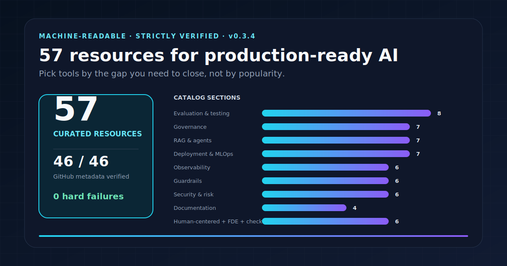
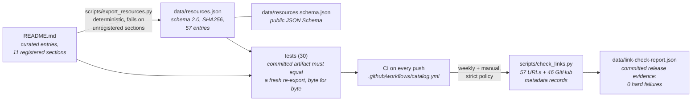

# Awesome AI Production Readiness

[中文说明](README.zh-CN.md)

  

## Find a starting point in 30 seconds

| Your immediate gap | Start here |
|---|---|
| Prompt, RAG or agent evaluation | [Evaluation and testing](#evaluation-and-testing) |
| Tracing and production behavior | [Observability and monitoring](#observability-and-monitoring) |
| Input/output controls | [Guardrails and safety](#guardrails-and-safety) |
| Threats and control review | [Security and risk frameworks](#security-and-risk-frameworks) |
| Governance documentation | [Responsible AI and governance](#responsible-ai-and-governance) |
| A complete handoff path | [Production path](docs/production_path.md) |

The [JSON catalog](data/resources.json) is machine-readable ([how to consume it](docs/using_the_catalog.md)) and the [strict release report](data/link-check-report.json) records link and GitHub metadata coverage. Suggest a resource through the [structured issue form](https://github.com/Anonymousyz/awesome-ai-production-readiness/issues/new?template=resource-suggestion.yml).

A curated, machine-readable reference for teams moving AI systems from prototype work into accountable operating environments.

The list is designed for a practical moment in AI delivery: a team has a promising model, RAG workflow, agent, or copilot, but needs to decide what must be evaluated, observed, controlled, documented, and owned before it touches a real business process. The resources cover evaluation and testing, observability, guardrails, security, responsible AI, governance, model and system documentation, human-centered design, deployment infrastructure, and FDE / applied-AI delivery practices.

This is not a ranking of every popular AI library. Each entry must have a concrete production-readiness use. The catalog distinguishes maintained tools from archived historical references, rejects duplicate URLs during export, records curation policy, and publishes a machine-readable JSON catalog for reuse.

> If an AI demo works, what evidence, controls, and operating ownership are needed before it enters a real workflow?

## Who should use this list

| Reader | Typical question | Where to start |
|---|---|---|
| Product or delivery lead | What needs to exist before a bounded pilot? | [Production path](docs/production_path.md), checklists, evaluation, and governance sections |
| AI / platform engineer | Which tools support testing, tracing, guardrails, or deployment? | Evaluation, observability, guardrails, RAG, and MLOps sections |
| Security, risk, or compliance reviewer | Which public frameworks and tooling help make controls reviewable? | Security and risk, responsible AI, documentation, and governance sections |
| FDE or solution architect | How do I connect tool selection to workflow, operating owner, and human decision? | [Production path](docs/production_path.md) and the two companion repositories |

---

## Production readiness lens

The curation lens is intentionally narrow:

> **Production-ready AI = workflow + evidence + governance + accountability.**

The related manifesto is here: [AI Production Readiness Manifesto](https://github.com/Anonymousyz/ai-prototype-to-production-toolkit/blob/main/MANIFESTO.md).

Resources stay on the list when they help answer production questions instead of stopping at model capability.

This catalog is regenerated from `README.md` and validated by the test suite in [`tests/`](tests/) (30 tests).

| Item | Value |
|---|---|
| Last manual curation review | 2026-07-16 |
| Machine-readable catalog | [`data/resources.json`](data/resources.json) |
| Curation and exclusion rules | [`docs/curation_policy.md`](docs/curation_policy.md) |
| Maintenance record | [`MAINTENANCE.md`](MAINTENANCE.md) |
| CI | Active workflow [`.github/workflows/catalog.yml`](.github/workflows/catalog.yml): every push rebuilds the catalog and runs the tests; live link checks stay on a weekly schedule and manual dispatch. Source template: [`docs/github_actions_catalog.template.yml`](docs/github_actions_catalog.template.yml) |

---

## Contents

- [Quick decision map](#quick-decision-map)
- [A production path, not a shopping list](docs/production_path.md)
- [Recommended starting set](docs/recommended_starting_set.md)
- [Evaluation and testing](#evaluation-and-testing)
- [Observability and monitoring](#observability-and-monitoring)
- [Guardrails and safety](#guardrails-and-safety)
- [Responsible AI and governance](#responsible-ai-and-governance)
- [Model/system documentation](#modelsystem-documentation)
- [Human-centered AI](#human-centered-ai)
- [Security and risk frameworks](#security-and-risk-frameworks)
- [RAG and agent production patterns](#rag-and-agent-production-patterns)
- [Deployment and MLOps infrastructure](#deployment-and-mlops-infrastructure)
- [Production readiness checklists](#production-readiness-checklists)
- [FDE and deployment workflow](#fde-and-deployment-workflow)
- [Chinese intro](#chinese-intro)

---

## Quick decision map

| If you need to... | Start with |
|---|---|
| Test prompts, RAG outputs or agents before shipping | promptfoo, DeepEval, OpenAI Evals, RAGAS |
| Monitor LLM traces and production behavior | Phoenix, Opik, Langfuse, Helicone |
| Add input/output validation and guardrails | Guardrails AI, NeMo Guardrails |
| Identify LLM security risks | OWASP LLM Top 10, garak, PyRIT |
| Create governance or risk documentation | NIST AI RMF, AI Verify, Responsible AI Toolbox, AI Prototype-to-Production Toolkit |
| Assess fairness and model risk | Fairlearn, AIF360, Responsible AI Toolbox |
| Build production RAG or agent apps | LlamaIndex, LangChain, LangGraph, Haystack, DSPy |
| Deploy models and services | BentoML, KServe, Seldon Core, Ray Serve, MLflow |

See also [`docs/decision_map.md`](docs/decision_map.md) and the compact [`recommended starting set`](docs/recommended_starting_set.md).

---

## Evaluation and testing

- [OpenAI Evals](https://github.com/openai/evals): Framework for evaluating LLMs and LLM systems; useful for custom evals and benchmark registries.
- [promptfoo](https://github.com/promptfoo/promptfoo): Test prompts, agents and RAGs; supports red teaming, model comparison and CI/CD.
- [DeepEval](https://github.com/confident-ai/deepeval): Pytest-like LLM evaluation framework with RAG, agentic, hallucination, toxicity and custom metrics.
- [RAGAS](https://github.com/vibrantlabsai/ragas): Evaluation framework for retrieval-augmented generation applications.
- [Giskard](https://github.com/Giskard-AI/giskard-oss): Testing framework for ML and LLM systems with vulnerability detection.
- [Evidently](https://github.com/evidentlyai/evidently): ML and LLM evaluation, monitoring and drift reports.
- [TruLens](https://github.com/truera/trulens): Evaluation and tracking for LLM applications.
- [EleutherAI lm-evaluation-harness](https://github.com/EleutherAI/lm-evaluation-harness): Language model evaluation harness used across many benchmarks.

## Observability and monitoring

- [Arize Phoenix](https://github.com/Arize-ai/phoenix): Open-source AI observability and evaluation platform for tracing, datasets, experiments and prompt management.
- [Opik](https://github.com/comet-ml/opik): Open-source platform for debugging, evaluating and monitoring LLM applications, RAG systems and agentic workflows.
- [Langfuse](https://github.com/langfuse/langfuse): Open-source LLM engineering platform for traces, evaluations, prompt management and metrics.
- [Helicone](https://github.com/Helicone/helicone): Open-source LLM observability platform and gateway.
- [OpenTelemetry](https://github.com/open-telemetry/opentelemetry-collector): Observability collector; useful foundation for production telemetry.
- [WhyLabs](https://github.com/whylabs/whylogs): **Maintenance review**; data and ML logging/profiling for monitoring pipelines, with current suitability to be checked before adoption.

## Guardrails and safety

- [NVIDIA NeMo Guardrails](https://github.com/NVIDIA-NeMo/Guardrails): Programmable guardrails for LLM conversational systems.
- [Guardrails AI](https://github.com/guardrails-ai/guardrails): Input/output guards, validators and structured output validation for LLM applications.
- [LLM Guard](https://github.com/protectai/llm-guard): **Archived upstream**; retained as a historical prompt/output sanitization reference, not a recommendation for new integrations.
- [Rebuff](https://github.com/protectai/rebuff): **Archived upstream**; retained as a historical prompt-injection defense reference, not a recommendation for new integrations.
- [Llama Guard](https://github.com/meta-llama/PurpleLlama): Meta Purple Llama safety tools including Llama Guard resources.
- [OWASP Top 10 for LLM Applications](https://owasp.org/www-project-top-10-for-large-language-model-applications/): Security risks and guidance for LLM applications.

## Responsible AI and governance

- [Microsoft Responsible AI Toolbox](https://github.com/microsoft/responsible-ai-toolbox): Model assessment dashboards for error analysis, fairness, interpretability and responsible AI workflows.
- [Fairlearn](https://github.com/fairlearn/fairlearn): Python package for assessing and improving fairness of machine learning systems.
- [AIF360](https://github.com/Trusted-AI/AIF360): IBM toolkit with fairness metrics and bias mitigation algorithms.
- [Microsoft Agent Governance Toolkit](https://github.com/microsoft/agent-governance-toolkit): Agent governance, policy enforcement, zero-trust identity, sandboxing and reliability engineering.
- [AI Verify](https://github.com/aiverify-foundation/aiverify): AI governance testing framework and software toolkit.
- [NIST AI RMF](https://www.nist.gov/itl/ai-risk-management-framework): AI Risk Management Framework.
- [OECD AI Principles](https://oecd.ai/en/ai-principles): International AI policy principles.

## Model/system documentation

- [TensorFlow Model Card Toolkit](https://github.com/tensorflow/model-card-toolkit): **Archived upstream**; retained as a historical model-card generator, not a recommendation for new integrations.
- [Model Cards for Model Reporting](https://arxiv.org/abs/1810.03993): Foundational paper on model cards.
- [Datasheets for Datasets](https://arxiv.org/abs/1803.09010): Foundational documentation pattern for datasets.
- [Hugging Face Model Cards](https://huggingface.co/docs/hub/en/model-cards): Practical model card documentation pattern used by the HF ecosystem.

## Human-centered AI

- [Google People + AI Guidebook](https://pair.withgoogle.com/guidebook/): Practical guidance for human-centered AI products, feedback, trust, autonomy and error handling.
- [Microsoft HAX Toolkit](https://www.microsoft.com/en-us/haxtoolkit/): Human-AI interaction guidelines and workbook.
- [PAIR Guidebook: User Needs + Defining Success](https://pair.withgoogle.com/guidebook/chapters/user-needs/): Useful for defining human-centered success criteria.

## Security and risk frameworks

- [NIST AI RMF Playbook](https://airc.nist.gov/airmf-resources/playbook/): Suggested actions mapped to NIST AI RMF Govern, Map, Measure and Manage functions.
- [OWASP GenAI Security Project](https://genai.owasp.org/): Security and safety resources for generative AI systems.
- [garak](https://github.com/NVIDIA/garak): LLM vulnerability scanner.
- [PyRIT](https://github.com/microsoft/PyRIT): Python Risk Identification Tool for generative AI red teaming.
- [Microsoft Counterfit](https://github.com/Azure/counterfit): **Maintenance review**; automation for assessing security of AI systems, with upstream activity to be checked before adoption.
- [Presidio](https://github.com/data-privacy-stack/presidio): Data protection and PII detection/anonymization toolkit.

## RAG and agent production patterns

- [LangChain](https://github.com/langchain-ai/langchain): Framework for LLM applications and integrations.
- [LangGraph](https://github.com/langchain-ai/langgraph): Framework for controllable agent workflows.
- [LlamaIndex](https://github.com/run-llama/llama_index): Data framework for LLM and RAG applications.
- [Haystack](https://github.com/deepset-ai/haystack): Framework for production NLP and RAG pipelines.
- [DSPy](https://github.com/stanfordnlp/dspy): Programming model for optimizing LM pipelines.
- [Microsoft AutoGen](https://github.com/microsoft/autogen): Multi-agent AI application framework.
- [CrewAI](https://github.com/crewAIInc/crewAI): Multi-agent automation framework.

## Deployment and MLOps infrastructure

- [MLflow](https://github.com/mlflow/mlflow): ML lifecycle platform for tracking, packaging and model registry.
- [BentoML](https://github.com/bentoml/BentoML): Model serving and AI application deployment framework.
- [KServe](https://github.com/kserve/kserve): Kubernetes model inference platform.
- [Seldon Core](https://github.com/SeldonIO/seldon-core): Model deployment and monitoring on Kubernetes.
- [Ray Serve](https://github.com/ray-project/ray): Scalable model serving framework in Ray.
- [DVC](https://github.com/treeverse/dvc): Data and model versioning.
- [lakeFS](https://github.com/treeverse/lakeFS): Data version control for object storage.

## Production readiness checklists

- [AI Prototype-to-Production Toolkit](https://github.com/Anonymousyz/ai-prototype-to-production-toolkit): Maintainer-authored checklists, scorecards, prompts and risk templates for assessing AI prototype readiness.

## FDE and deployment workflow

- [OpenAI Cookbook](https://github.com/openai/openai-cookbook): Practical examples and guides for working with the OpenAI API.
- [Anthropic Cookbook](https://github.com/anthropics/claude-cookbooks): Practical Claude examples and recipes.

---

## Chinese intro

这个仓库不是泛泛的 AI 资料清单，而是聚焦一个问题：

> 一个 AI demo 如果要进入真实业务流程，还差哪些生产化条件？

适合关注：AI 落地、FDE、LLMOps、AI 治理、模型评估、RAG/Agent 生产化、受监管行业 AI 部署的人收藏。

---

## How this list is maintained

Every claim the catalog makes is backed by a pipeline you can rerun:

Entries follow the published [`curation policy`](docs/curation_policy.md). The README is exported to a versioned [`machine-readable catalog`](data/resources.json) governed by a public [`JSON Schema`](data/resources.schema.json). Duplicate URLs, canonical GitHub locations, explicit archive status, and the committed export are tested. `curated_at` records the catalog review/generation date; per-resource `last_verified` is nullable and is filled only after explicit item-level verification, not automatically copied from `curated_at`. Both dates must be valid, non-future ISO dates and `last_verified` cannot be later than `curated_at`. Links and upstream metadata can be probed with [`scripts/check_links.py`](scripts/check_links.py): the default `strict` policy fails closed when GitHub canonical/archive metadata is unverified, while `--metadata-policy soft` records incomplete coverage for interactive diagnosis. Automated accessibility is separated from manual relevance review because some live sites block bots or rate-limit requests.

Running the strict metadata check locally works best with a `GITHUB_TOKEN` environment variable set; without it, GitHub API rate limits usually surface as unverified-metadata failures (CI injects the built-in token automatically).

Contributions must disclose affiliation and explain the concrete production-readiness use. See [`CONTRIBUTING.md`](CONTRIBUTING.md).

---

## Related project

This list is maintained alongside the [AI Prototype-to-Production Toolkit](https://github.com/Anonymousyz/ai-prototype-to-production-toolkit), which turns the same lens into checklists, examples, schema, and a local CLI. When a readiness review needs to become a decision packet, use the [Research-to-Decision Toolkit](https://github.com/Anonymousyz/research-to-decision-toolkit).

---

## License

Catalog data, generated catalog evidence, prose, and automation do not share one blanket license. See the path-by-path [`LICENSE-SCOPE.md`](LICENSE-SCOPE.md): catalog/prose paths are dedicated under CC0-1.0 via [`LICENSE`](LICENSE), while Python scripts/tests, `data/resources.schema.json`, and the CI template are licensed under MIT via [`LICENSE-CODE`](LICENSE-CODE). The root CC0 dedication does not apply to those MIT-only paths. Individual projects, names, trademarks, patents, and source code retain their own rights; inclusion does not relicense or endorse them.